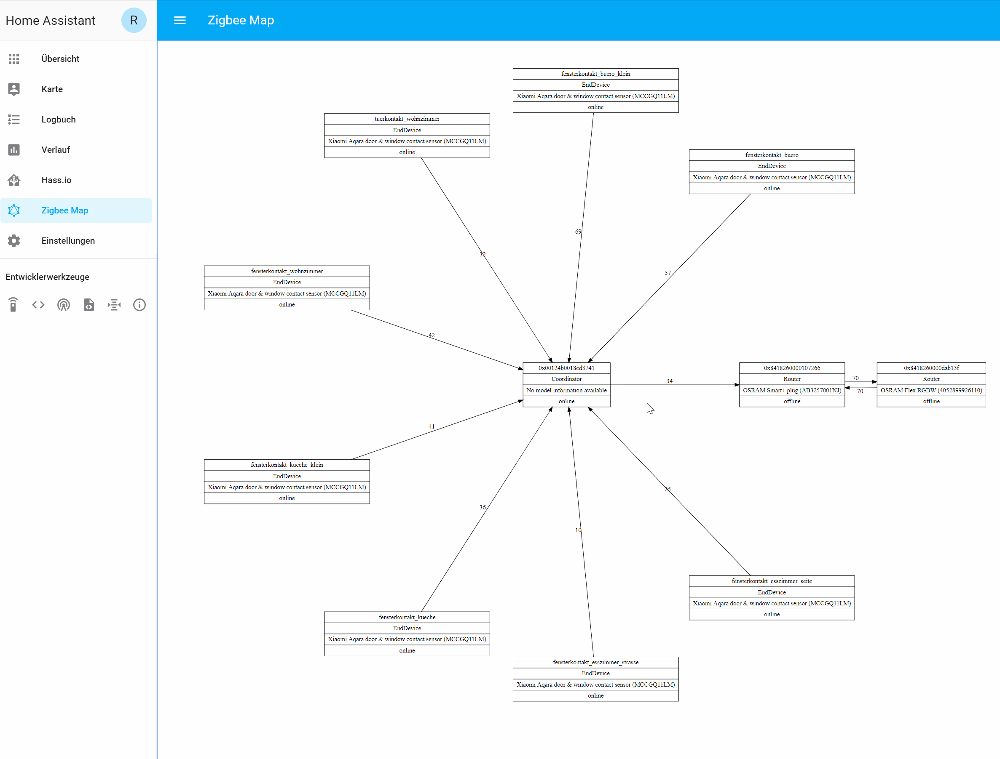

# ha_zigbee2mqtt_networkmap
Custom Component for Homeassistant to show the [zigbee2mqtt](https://github.com/Koenkk/zigbee2mqtt) Networkmap with [viz.js](https://github.com/mdaines/viz.js/).

[Forum link with Screenshot](https://community.home-assistant.io/t/zigbee2mqtt-show-the-networkmap-in-hassio/89116)

**Important:** you have to clear the browsercache after each update

**Instructions**
1. Download or clone [https://github.com/rgruebel/ha_zigbee2mqtt_networkmap](https://github.com/rgruebel/ha_zigbee2mqtt_networkmap)
2. Copy "custom_components/zigbee2mqtt_networkmap.py" to your "custom_components" folder.
3. Copy the folder "www/zigbee2mqtt_networkmap" and content to your "www" folder.
4. Add the following to your configuration.yaml. It is possible to update the map directly via button. If you want to use this functionality you also have to activate the webhook component

        webhook:
        
        zigbee2mqtt_networkmap:
        
        panel_iframe:
          networkmap:
            title: 'Zigbee Map'
            url: '/local/zigbee2mqtt_networkmap/map.html'
            icon: 'mdi:graphql'
    You can set the graphviz engine via URL Parameter: 
    map.html?engine=circo (Default: circo, [Supported Engines](https://github.com/mdaines/viz.js/wiki/Supported-Graphviz-Features))  
    
5. Restart Homeassistant
6. Call the service "zigbee2mqtt_networkmap.update"
7. Test if everything is working

Now you should create an automation which calls the service  "zigbee2mqtt_networkmap.update" for example every 10 minutes:

      - id: update_networkmap
        alias: 'Zigbee Map aktualisieren'  
        hide_entity: true  
        trigger:
          platform: time
          minutes: '/10'
          seconds: 00
        action:
          service: zigbee2mqtt_networkmap.update
